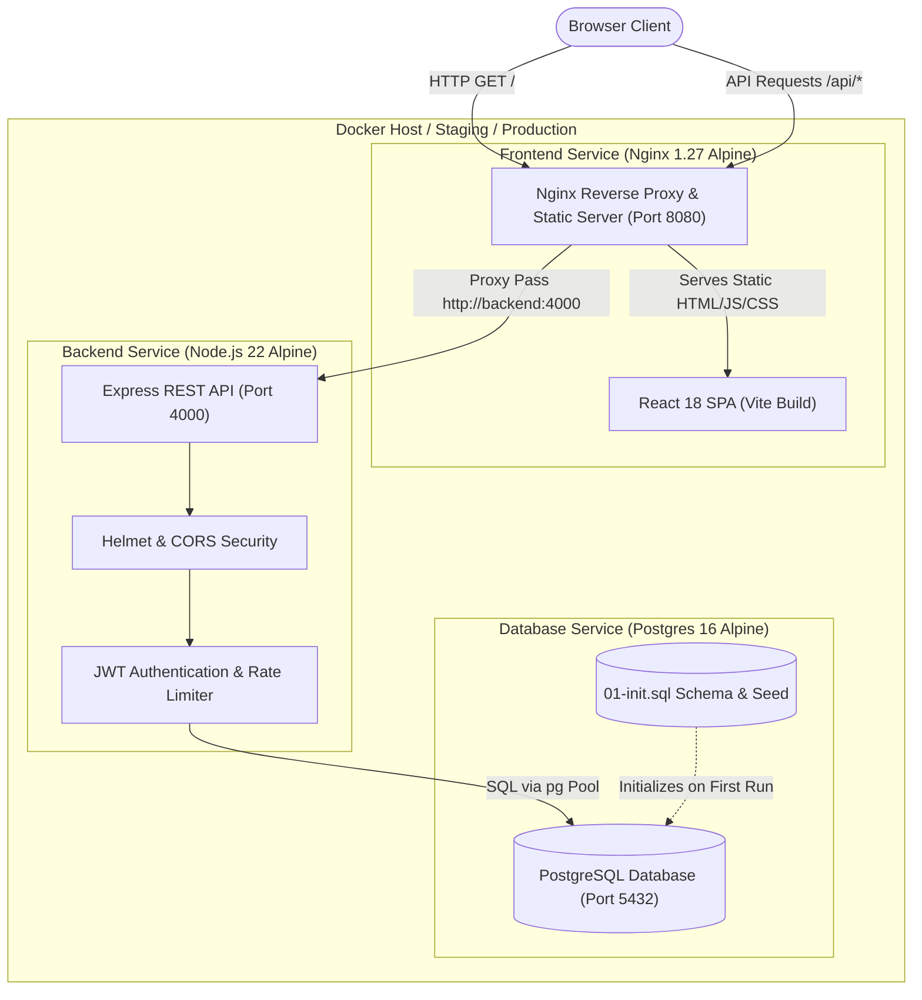
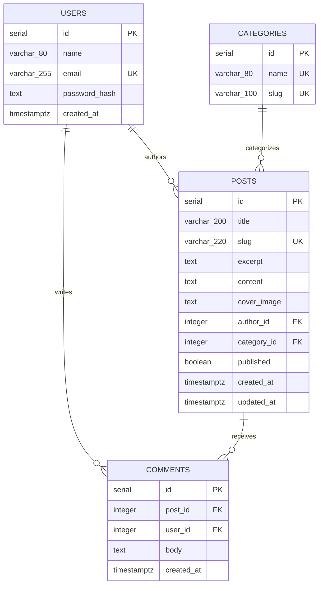

# InkForge

[](https://github.com/olayinka789/InkForge/actions/workflows/main.yml)
[](https://nodejs.org/)
[](https://react.dev/)
[](https://www.postgresql.org/)
[](LICENSE)

**InkForge** is a modern, production-grade full-stack blogging platform and DevSecOps reference architecture. It pairs a React and Vite single-page application with a secure Express REST API and PostgreSQL database, packaged into multi-stage rootless Docker containers and backed by an automated 8-stage DevSecOps CI/CD pipeline targeting Microsoft Azure.

---

## Table of Contents

- [System Architecture](#system-architecture)
- [DevSecOps Pipeline](#devsecops-pipeline)
- [Key Features](#key-features)
- [Tech Stack](#tech-stack)
- [Repository Structure](#repository-structure)
- [Prerequisites](#prerequisites)
- [Quick Start (Docker Compose)](#quick-start-docker-compose)
- [Local Development Setup](#local-development-setup)
- [Environment Variables](#environment-variables)
- [API Reference](#api-reference)
- [Database Schema](#database-schema)
- [Security Hardening](#security-hardening)
- [CI/CD & DevSecOps Workflow](#cicd--devsecops-workflow)
- [Testing & Code Quality](#testing--code-quality)
- [Production Deployment](#production-deployment)
- [License](#license)

---

## System Architecture



---

## DevSecOps Pipeline

The repository includes a GitHub Actions pipeline (`.github/workflows/main.yml`) implementing Shift-Left DevSecOps principles:

```mermaid
flowchart LR
    A["Code Commit / PR"] --> B["1. Linters (ESLint + Prettier)"]
    B --> C["2. Secret Scan (Gitleaks)"]
    C --> D["3. SAST (SonarQube)"]
    D --> E["4. SCA (Snyk Vulnerabilities)"]
    E --> F["5. Container Scan (Trivy) & Push to ACR"]
    F --> G["6. Deploy Staging (Docker Compose + ngrok)"]
    G --> H["7. DAST Scan (OWASP ZAP)"]
    H --> I["8. Deploy Production (Azure Container Apps)"]
```



---

## Key Features

- **Reader Experience**: Clean, editorial-style journal interface with responsive grid layouts, category filtering, featured stories, reading views, and discussion threads.
- **Author & Member Portal**: User registration and JWT-authenticated login sessions with local storage state management.
- **Content Management**: CRUD operations for blog posts with auto-generated slugs (via `slugify`), excerpts, cover image fallbacks, category tagging, and publication status toggles.
- **Interactive Discussions**: Authenticated commenting system tied directly to blog articles with cascade deletion.
- **Category Taxonomy**: Structured categorization (Technology, Travel, Design, etc.) with URL slugs and dynamic navigation.
- **Production-Ready Containerization**: Optimized multi-stage Dockerfiles for frontend and backend with non-root security execution (`node` and `app` system users).
- **Hardened Security**: Helmet protection, strict CORS controls, IP-based rate limiting on sensitive routes, parameterized queries, and bcrypt password hashing.

---

## Tech Stack

| Layer | Technologies & Tools | Description |
|---|---|---|
| **Frontend** | React 18, Vite 5, Vanilla CSS | Single Page Application (SPA) with responsive design |
| **Reverse Proxy** | Nginx 1.27 Alpine | Serves static frontend assets and reverse-proxies `/api/` traffic |
| **Backend** | Node.js 22, Express 4 | Modular REST API with JSON response format |
| **Authentication** | JWT (`jsonwebtoken`), `bcryptjs` | Stateless Bearer token authentication and 12-round salted password hashing |
| **Database** | PostgreSQL 16 Alpine, `pg` (node-postgres) | Relational database with pooled connections and foreign key cascades |
| **Containerization** | Docker, Docker Compose | Multi-stage image builds, custom bridge networking, healthchecks |
| **CI/CD & DevSecOps** | GitHub Actions | Automated linting, secret detection, SAST, SCA, container scanning, DAST, and deployment |
| **Security Tooling** | Gitleaks, SonarQube, Snyk, Aquasecurity Trivy, OWASP ZAP | End-to-end security compliance pipeline |
| **Cloud Hosting** | Azure Container Registry (ACR), Azure Container Apps (ACA) | Fully managed containerized production environment |

---

## Repository Structure

```
InkForge/
├── .github/
│   ├── dependabot.yml              # Dependabot automated dependency update configuration
│   └── workflows/
│       └── main.yml                # 8-stage DevSecOps CI/CD pipeline
├── backend/
│   ├── src/
│   │   └── server.js               # Express application routes, middleware, and database pool
│   ├── test/
│   │   └── health.test.js          # Native Node.js test runner unit/health checks
│   ├── .env.example                # Backend-specific environment variables template
│   ├── Dockerfile                  # Multi-stage production container build (Node 22)
│   ├── package.json                # Backend scripts and dependencies
│   └── package-lock.json           # Backend dependency lockfile
├── database/
│   └── init.sql                    # PostgreSQL initial DDL schema and demo seed data
├── frontend/
│   ├── src/
│   │   ├── main.jsx                # React root component and SPA UI logic
│   │   └── style.css               # Clean typography, layout, and component styling
│   ├── Dockerfile                  # Multi-stage production container build (Nginx + static build)
│   ├── eslint.config.mjs           # Flat ESLint configuration with React plugin
│   ├── index.html                  # HTML entry point with Google Fonts
│   ├── nginx.conf                  # Nginx HTTP server, proxy pass, and SPA routing config
│   ├── package.json                # Frontend build scripts and dependencies
│   ├── package-lock.json           # Frontend dependency lockfile
│   └── vite.config.js              # Vite bundler configuration
├── .env.example                    # Root environment variables for Docker Compose
├── .gitignore                      # Comprehensive Git exclusion rules
├── docker-compose.yml              # Multi-container local/staging orchestration
├── package.json                    # Workspace monorepo root definition
├── package-lock.json               # Root workspace lockfile
└── README.md                       # Repository documentation
```

---

## Prerequisites

Ensure you have the following tools installed locally:

- [Git](https://git-scm.com/) (v2.30+)
- [Docker](https://docs.docker.com/get-docker/) (v24.0+) and [Docker Compose](https://docs.docker.com/compose/) (v2.20+)
- [Node.js](https://nodejs.org/) (v20.x or v22.x LTS) *(for bare-metal development)*
- [npm](https://www.npmjs.com/) (v10.x+)

---

## Quick Start (Docker Compose)

The fastest way to spin up the complete InkForge stack (PostgreSQL, Express API, and Nginx/React frontend) is using Docker Compose:

### 1. Clone the Repository

```bash
git clone https://github.com/olayinka789/InkForge.git
cd InkForge
```

### 2. Configure Environment Variables

Copy the sample environment file:

```bash
cp .env.example .env
```

Review and customize secrets in `.env`:

```env
POSTGRES_DB=blog
POSTGRES_USER=blog
POSTGRES_PASSWORD=change-me
JWT_SECRET=replace-with-a-long-random-secret
API_PORT=4000
CLIENT_ORIGIN=http://localhost:8080
VITE_API_URL=/api
```

### 3. Build and Start Services

```bash
docker compose up --build
```

To run in detached background mode:

```bash
docker compose up -d --build
```

### 4. Verify the Application

- **Web Application**: Open [http://localhost:8080](http://localhost:8080) in your browser.
- **API Health Check**: Access [http://localhost:8080/api/health](http://localhost:8080/api/health) (proxied through Nginx).
- **Default Seeded Account**:
  - **Email**: `demo@example.com`
  - **Password**: `demo-password`

To stop and remove containers:

```bash
docker compose down
```

To remove containers and wipe database volumes:

```bash
docker compose down -v
```

---

## Local Development Setup

If you prefer to run services bare-metal without containerizing frontend and backend:

### 1. Start PostgreSQL Only

Run PostgreSQL with its migration initialization via Docker:

```bash
docker compose up db -d
```

### 2. Backend Setup

In a separate terminal window:

```bash
cd backend
cp .env.example .env
npm install
npm run dev
```

The Express API will listen on `http://localhost:4000`.

### 3. Frontend Setup

In a separate terminal window:

```bash
cd frontend
npm install
npm run dev
```

The Vite development server will listen on `http://localhost:5173`. When developing with Vite independently, set:

```bash
export VITE_API_URL=http://localhost:4000/api
```

### 4. Running Monorepo Scripts from Root

From the repository root directory, npm workspaces allow executing scripts across packages:

```bash
# Install all dependencies across workspaces
npm install

# Run backend and frontend concurrently
npm run dev

# Build the frontend for production
npm run build
```

---

## Environment Variables

| Variable | Scope | Default in Compose | Description |
|---|---|---|---|
| `POSTGRES_DB` | Root / Compose / DB | `blog` | PostgreSQL database name |
| `POSTGRES_USER` | Root / Compose / DB | `blog` | PostgreSQL database user |
| `POSTGRES_PASSWORD` | Root / Compose / DB | `change-me` | PostgreSQL database password |
| `DATABASE_URL` | Backend | `postgres://blog:change-me@db:5432/blog` | Full connection URI for `pg.Pool` |
| `JWT_SECRET` | Root / Backend | `replace-with-a-long-random-secret` | HMAC secret key used to sign and verify JSON Web Tokens |
| `API_PORT` | Root / Backend | `4000` | Port on which the Express server listens |
| `CLIENT_ORIGIN` | Root / Backend | `http://localhost:8080` | Allowed CORS origin for browser requests |
| `VITE_API_URL` | Frontend Build | `/api` | Base path or URL used by frontend API client |

---

## API Reference

All responses return standard JSON payloads. Protected endpoints require the `Authorization: Bearer <JWT_TOKEN>` request header.

### Health Check

| Method | Endpoint | Access | Description |
|---|---|---|---|
| `GET` | `/api/health` | Public | Checks database connectivity and returns server status |

**Response (200 OK):**
```json
{
  "status": "ok",
  "database": "connected"
}
```

---

### Authentication

| Method | Endpoint | Access | Description |
|---|---|---|---|
| `POST` | `/api/auth/register` | Public (Rate-limited) | Creates a new user account and returns JWT token |
| `POST` | `/api/auth/login` | Public (Rate-limited) | Authenticates existing user credentials and returns JWT token |

#### Register Payload
```json
{
  "name": "Jane Doe",
  "email": "jane@example.com",
  "password": "strong-password"
}
```

#### Login Payload
```json
{
  "email": "demo@example.com",
  "password": "demo-password"
}
```

**Success Response (200 OK / 201 Created):**
```json
{
  "user": {
    "id": 1,
    "name": "Jane Doe",
    "email": "jane@example.com"
  },
  "token": "eyJhbGciOiJIUzI1NiIsInR5cCI6IkpXVCJ9..."
}
```

---

### Blog Posts

| Method | Endpoint | Access | Description |
|---|---|---|---|
| `GET` | `/api/posts` | Public | List published posts (supports `?category=<slug>` query filter) |
| `GET` | `/api/posts/:slug` | Public | Fetch single post by slug, including full comment thread |
| `POST` | `/api/posts` | Protected | Create a new blog post |
| `PUT` | `/api/posts/:id` | Protected | Update an owned blog post |
| `DELETE` | `/api/posts/:id` | Protected | Delete an owned blog post |

#### Create Post Payload
```json
{
  "title": "Scaling Modern Container Workloads",
  "excerpt": "A deep dive into container orchestration and microservices.",
  "content": "Full article body markdown or text goes here...",
  "categoryId": 1,
  "published": true
}
```

---

### Comments

| Method | Endpoint | Access | Description |
|---|---|---|---|
| `POST` | `/api/posts/:id/comments` | Protected | Add a comment to a specific blog post |
| `DELETE` | `/api/comments/:id` | Protected | Delete an owned comment |

#### Add Comment Payload
```json
{
  "body": "This article provided great insights, thank you!"
}
```

---

### Categories

| Method | Endpoint | Access | Description |
|---|---|---|---|
| `GET` | `/api/categories` | Public | Retrieve all categories sorted by name |
| `POST` | `/api/categories` | Protected | Create a new category |
| `PUT` | `/api/categories/:id` | Protected | Update category name and slug |
| `DELETE` | `/api/categories/:id` | Protected | Remove an empty category |

---

## Database Schema

The database is built on PostgreSQL 16 and initialized via `database/init.sql`.



### Performance & Integrity Highlights
- **Indexes**: Includes `posts_created_idx` on `posts(created_at DESC)` and `comments_post_idx` on `comments(post_id)` to ensure fast feed queries and comment thread lookups.
- **Cascades**: Deleting an author cascades to their posts and comments (`ON DELETE CASCADE`). Deleting a category sets related posts' `category_id` to `NULL` (`ON DELETE SET NULL`), preventing orphaned errors.

---

## Security Hardening

InkForge follows security-in-depth design across application code and infrastructure:

1. **HTTP Headers**: [Helmet](https://helmetjs.github.io/) applies hardened security headers (disables `X-Powered-By`, sets `X-Frame-Options: SAMEORIGIN`, and configures strict content types).
2. **CORS Whitelisting**: The Express backend restricts browser origin access based on the configured `CLIENT_ORIGIN` variable.
3. **Brute Force Defense**: `express-rate-limit` enforces a threshold of 40 requests per 15-minute window on all `/api/auth/*` routes.
4. **Credential Hashing**: Passwords are never stored in plaintext; they are hashed with `bcryptjs` using a cost factor of 12 rounds.
5. **SQL Injection Elimination**: All database queries are executed using parameterized statements via node-postgres (`$1, $2, ...`).
6. **Denial-of-Service Defense**: Request payload bodies are strictly capped at `1mb` (`express.json({ limit: '1mb' })`).
7. **Least-Privilege Containers**: Container images execute under unprivileged user identities:
   - Backend runs as non-root user `node` (UID/GID 1000).
   - Frontend runs as unprivileged system user `app` under Nginx.

---

## CI/CD & DevSecOps Workflow

The GitHub Actions workflow located at `.github/workflows/main.yml` orchestrates automated validation and deployment across 8 stages:

```
[PR / Push to main]
       │
       ├─► 1. Linters (ESLint & Prettier on frontend)
       ├─► 2. Secret Scanning (Gitleaks for credential leaks)
       ├─► 3. SAST Scan (SonarQube code quality and vulnerability scan)
       ├─► 4. SCA Scan (Snyk open-source dependency auditing)
       │
       ▼
  5. Container Scan & Push (Trivy scan for CRITICAL CVEs -> Push to Azure Container Registry)
       │
       ▼
  6. Deploy Staging (Deploy on self-hosted runner via Docker Compose + ngrok public tunnel)
       │
       ▼
  7. DAST Scan (OWASP ZAP Dynamic Application Security Testing against running staging endpoint)
       │
       ▼
  8. Deploy Production (Deploy frontend & backend to Azure Container Apps)
```

### Required GitHub Repository Secrets

To enable the complete automated CI/CD pipeline, configure the following secrets in GitHub (**Settings** > **Secrets and variables** > **Actions**):

| Secret Name | Purpose |
|---|---|
| `AZURE_CREDENTIALS` | Service Principal JSON credentials for Azure login (`azure/login@v2`) |
| `ACR_USERNAME` | Azure Container Registry admin username |
| `ACR_PASSWORD` | Azure Container Registry admin password |
| `SONAR_TOKEN` | Authentication token for SonarQube Scanner |
| `SNYK_TOKEN` | API token for Snyk dependency vulnerability scans |
| `GITHUB_TOKEN` | Automatically supplied by GitHub Actions for Gitleaks and ZAP checks |

---

## Testing & Code Quality

### Backend Tests

InkForge uses Node.js's built-in test runner (`node:test`) for lightweight, zero-dependency testing:

```bash
cd backend
npm test
```

### Frontend Linting & Formatting

Check and format React code:

```bash
cd frontend

# Run ESLint
npx eslint .

# Format with Prettier
npx prettier --check .
```

---

## Production Deployment

### Container Optimization
- **Backend Dockerfile**: Uses a multi-stage approach with `node:22-alpine`, pruning dev dependencies with `npm ci --omit=dev`, and setting `NODE_ENV=production`.
- **Frontend Dockerfile**: Multi-stage build running `npm run build` in Node 22, copying only the compiled static `/dist` bundle into a clean `nginx:1.27-alpine` runtime image.

### Production Routing (Nginx)
The frontend container uses custom Nginx configuration (`frontend/nginx.conf`):
- Directs static files and client-side routes to `/index.html` via `try_files $uri $uri/ /index.html`.
- Proxies `/api/` calls seamlessly to the backend service.

---

## Contributing

1. Fork the repository (`https://github.com/olayinka789/InkForge.git`).
2. Create a feature branch (`git checkout -b feature/amazing-feature`).
3. Commit your changes (`git commit -m 'feat: add amazing feature'`).
4. Push to the branch (`git push origin feature/amazing-feature`).
5. Open a Pull Request against the `main` branch.

---

## License

This project is licensed under the [MIT License](LICENSE).
